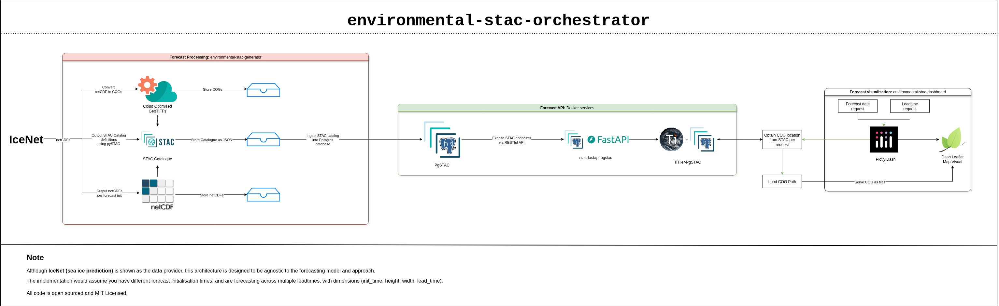
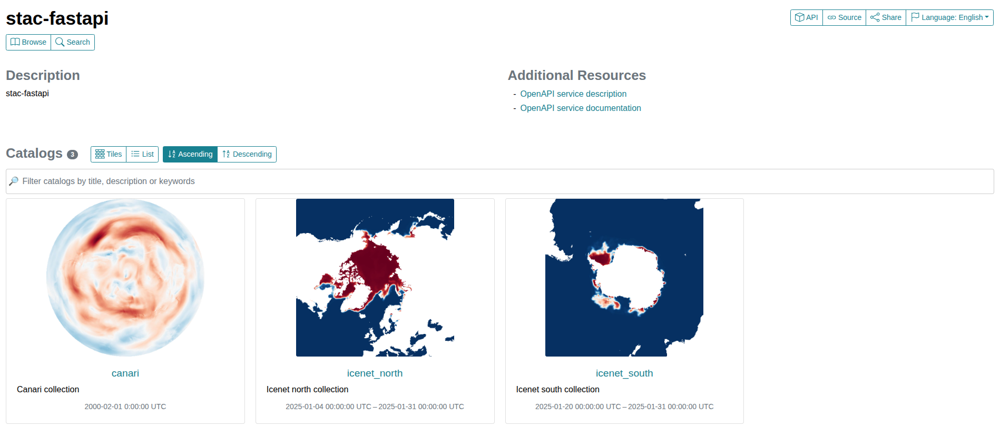
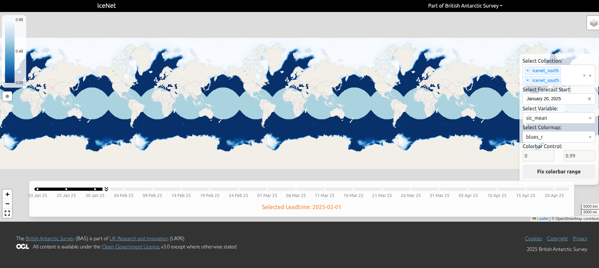
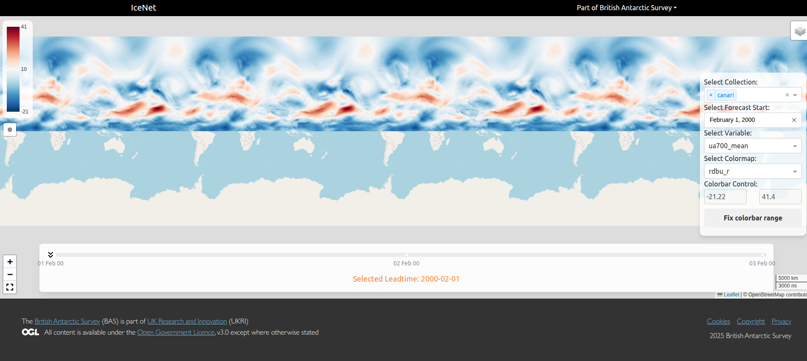

# BAS STAC deployment orchestrator

This meta-repository coordinates deployment of a modular architecture designed to process netCDF weather forecast predictions from Machine Learning workflows, catalog them (using STAC catalog), and serve them via layers of Databases, APIs and Dashboard.

- **[environmental-stac-generator](https://github.com/environmental-forecasting/environmental-stac-generator)** – An installable Python package that converts netCDF files to Cloud-Optimised GeoTIFFs (COGs) for use by the tiler.
- **[environmental-stac-dashboard](https://github.com/environmental-forecasting/environmental-stac-dashboard)** – A Plotly Dash web app for visualising environmental forecasts.

---

## Repo Structure

```bash
meta-repo/
├── custom_tms/ # Custom TileMatrixSets defining Matrix Sets for North and South projections (used by TiTiler Docker service)
├── environmental-stac-dashboard/ # Plotly Dash web-app served with Gunicorn
├── environmental-stac-generator/ # Data transformer: NetCDF → COGs, generate STAC catalog, ingest into pgSTAC database
├── data/ # Output COGs and STAC catalog generated by running `envstacgen` command from `environmental-stac-generator` install on IceNet and other prediction netCDF files
├── compose.yaml # Orchestrates all containers
└── Makefile # Top-level automation commands
```

This is the basic workflow, and how the different repositories interact between each other:



---

## Getting Started

### 1. Install Docker

Ensure [Docker](https://docs.docker.com/get-docker/) is installed on your system.


### 2. Clone the repo

To clone this repository and all including submodules, run:

```bash
git clone --recurse-submodules git@github.com:environmental-forecasting/environmental-stac-orchestrator.git
```

or, optionally, to clone a specific branch, run:

```bash
git clone --recurse-submodules -b 0.0.1_dev git@github.com:environmental-forecasting/environmental-stac-orchestrator.git
```

where, `-b <branch_name>` defines the branch you want to utilise.

### 3. Set up configuration ENV file

Each service can be configured via environment variables. They
are orchestrated via `compose.yaml` for consistency across
environments.

Run the following script which will output a minimal `.env` file which
includes the ports the components should be deployed one, and the IP
address that the COGs should be accessible from.

```bash
./generate_env.sh
```

This can be updated as necessary, including the default database password. Though, note that once the next step is
run, the db password is set based on the definition of the `.env` file. So, to update password, would need to use
standard postgresql approach to update it, or, clear the postgresql volume (`make clear-db`) and re-build the
services (next step) after updating `.env` file.

### 4. Build & Launch the Full Stack

#### Start containers

```bash
make up
```

This will:

* Build all service images (environmental-stac-dashboard, pgstac, stac-fastapi, file-server, stac-browser).
* Launch the dashboard and tile server stack via docker-compose.


#### Stop containers

```bash
make down
```

### 5. Install and Run netCDF -> CoG Preprocessor

> [!NOTE]
> This step will run without any of the Docker services running.

```bash
pip install -e environmental-stac-generator/

envstacgen preprocess 1days <path_to_netcdf_predictions>
```

#### Example usage:

To point to a directory with netCDF files:

`envstacgen preprocess 1days results/predict/`

Using wildcards:

`envstacgen preprocess 1days raw_data/*.nc`

You can include a non-default **STAC Catalog** and **STAC Collection** name (and, multiple workers):

`envstacgen preprocess 1days raw_data/*.nc -o -n <catalog_name> -w 8`

Where, in this implementation, the catalog name and collection name are the same. Hence,
one catalog holds only one collection.

This command will create a `data/` directory with the JSON catalog and CoG outputs.

```bash
data/
├── cogs/
│   └── <catalog_name>/
│       └── <collection_name>/
│           └── <forecast_init_date>/
│               ├── forecast_init_<forecast_init_date>_lead_<valid_time>.jpg        # Thumbnail file
│               ├── forecast_init_<forecast_init_date>_lead_<valid_time>.tif        # COG w/ internal overviews
│               └── forecast_init_<forecast_init_date>_lead_<valid_time>.tif.ovr    # External overviews
├── netcdf/
│   └── <catalog_name>/
│       └── <collection_name>/
│          └── <forecast_init_date>/
│              └── <forecast_init_date>.nc # netCDF predictions for this forecast init date, with all leadtimes stored in this file
└── stac/
    └── <catalog_name>/
        ├── <collection_name>/  # In this implementation, <catalog_name> and <collection_name> are the same
        │   └── forecast_init_<forecast_init_date>/
        │       ├── forecast_init_<forecast_init_date>.json
        │       └── collection.json
        └── catalog.json

```

where, `valid_time` is the datetime corresponding to the forecast leadtime. (The date the COG prediction is for).


### 6. Ingest the JSON STAC catalogs into the Docker database service

> [!IMPORTANT]
> Ensure you have the Docker services up and running before proceeding with this step since it relies on the Database being accessible.

To ingest the generated static STAC JSON catalog into the pgSTAC (postgresql) database, run:

```bash
envstacgen ingest data/stac/<catalog_name>/catalog.json -o
```

where, the `-o` will overwrite any existing matching entries (by default, will skip any matching).
And, this command can be run for each catalog that has been generated.

### 7. Access the UI Interfaces and Docs

The services will be available on these default ports (configurable in `.env`):

* **Dashboard UI:** http://localhost
* **STAC Browser:** http://localhost:81
* **STAC FastAPI:** http://localhost:8000/api.html
* **File Server:** http://localhost:8001
* **Tiler API:** http://localhost:8002
* **PostgreSQL Database:** http://localhost:5432

### 8. Additional Make commands

#### Clear outputs

> [!CAUTION]
> These commands are destructive and will delete any generated data, only included for convenience.

To clear the data created by `envstacgen preprocess` command, run:

```bash
make clear-data
```

To delete the PostGreSQL database volume (will clear any ingested data in the database), run the following:

```bash
make clear-db
```

To clear both the data and database, run the following:

```bash
make clear-all
```

### FAQ

1. I see the following error with the database service:

```bash
pgstac-1    | Running PgSTAC migration...
database-1  | 2025-07-17 09:19:09.995 UTC [85] ERROR:  relation "pgstac.migrations" does not exist at character 38
database-1  | 2025-07-17 09:19:09.995 UTC [85] STATEMENT:  
database-1  |                   SELECT version from pgstac.migrations
database-1  |                   order by datetime desc, version desc limit 1;
database-1  |                   
pgstac-1    | 0.9.6
pgstac-1    | PgSTAC migration completed
pgstac-1 exited with code 0
```

This is expected, and part of `pypgstac migrate`'s approach when initialising an empty database.

### Examples

#### STAC Browser



#### Dashboard



CANARI example: (At altitude, so, not surface level variable, needs coastline overlay in future)

