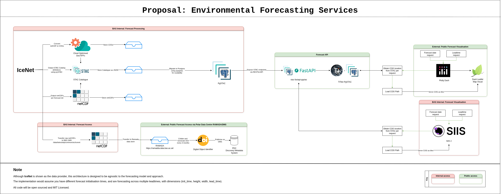

# IceNet Dashboard deployment repo

This meta-repository coordinates a modular, containerised icenet dashboard application composed of:

- **[environmental-stac-generator](https://github.com/environmental-forecasting/environmental-stac-generator)** – An installable Python package that converts netCDF files to Cloud-Optimised GeoTIFFs (COGs) for use by the tiler.
- **[environmental-stac-dashboard](https://github.com/environmental-forecasting/environmental-stac-dashboard)** – A Plotly Dash web app for visualising environmental forecasts.

---

## Repo Structure

```bash
meta-repo/
├── environmental-stac-dashboard/ # Plotly Dash web-app served with Gunicorn
├── environmental-stac-generator/ # Data transformer: NetCDF → COGs
├── data/ # Output COGs and STAC catalog generated by running `envstacgen` command from `environmental-stac-generator` install on IceNet and other prediction netCDF files
├── compose.yaml # Orchestrates all containers
└── Makefile # Top-level automation commands
```

This is the basic workflow:



---

## Getting Started

### 1. Install Docker

Ensure [Docker](https://docs.docker.com/get-docker/) is installed on your system.

---

### 2. Install and Run IceNet netCDF -> CoG Preprocessor

```bash
pip install -e environmental-stac-generator/

envstacgen preprocess 1days <path_to_icenet_netcdf_predictions>
```

#### Example usage:

To point to a directory with netCDF files:

`envstacgen preprocess 1days results/predict/`

Using wildcards:

`envstacgen preprocess 1days raw_data/*.nc`

This will create a `data/` directory with the JSON catalog and CoG outputs.

```bash
data/
├── cogs/
│   └── <collection_name>/
│       ├── north/
│       └── south/
└── stac/
    ├── <collection_name>/
    │   ├── <hemisphere>_<forecast_init_date>/
    │   └── collection.json
    └── catalog.json
```

### 3. Set up configuration ENV file (WIP)

Each service can be configured via environment variables. They
are orchestrated via `compose.yaml` for consistency across
environments.

Run the following script which will output a minimal `.env` file which
includes the ports the components should be deployed one, and the IP
address that the COGs should be accessible from.

```bash
./generate_env.sh
```

This is a Work in Progress since originally each component of the stack was run independently.

### 4. Build & Launch the Full Stack

```bash
make up
```

This will:

* Build all service images (environmental-stac-dashboard, pgstac, stac-fastapi, file-server, stac-browser).
* Launch the dashboard and tile server stack via docker-compose.

To delete the PostGreSQL database volume (will clear the data), run the following:


### 5. Access the UI Interfaces and Docs

The services will be available on these default ports (configurable in `.env`):

* **Dashboard UI:** http://localhost
* **STAC Browser:** http://localhost:81
* **Tiler API:** http://localhost:8000
* **STAC FastAPI:** http://localhost:8001
* **File Server:** http://localhost:8002

### FAQ

1. I see the following error with the database service:

```bash
pgstac-1    | Running PgSTAC migration...
database-1  | 2025-07-17 09:19:09.995 UTC [85] ERROR:  relation "pgstac.migrations" does not exist at character 38
database-1  | 2025-07-17 09:19:09.995 UTC [85] STATEMENT:  
database-1  |                   SELECT version from pgstac.migrations
database-1  |                   order by datetime desc, version desc limit 1;
database-1  |                   
pgstac-1    | 0.9.6
pgstac-1    | PgSTAC migration completed
pgstac-1 exited with code 0
```

This is expected, and part of `pypgstac migrate`'s approach when initialising an empty database.
