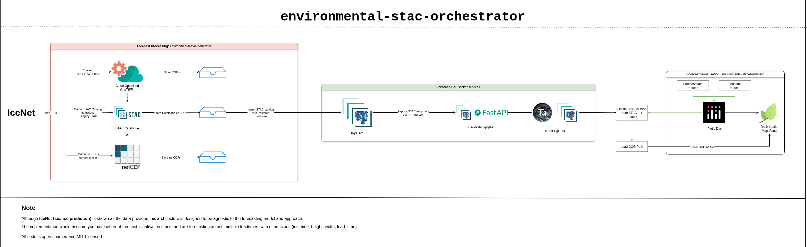
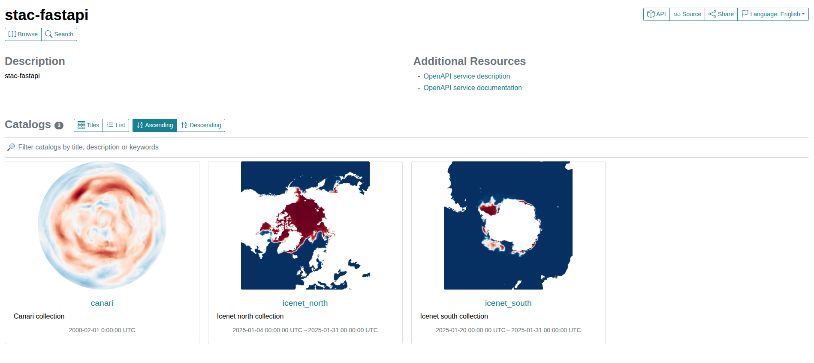
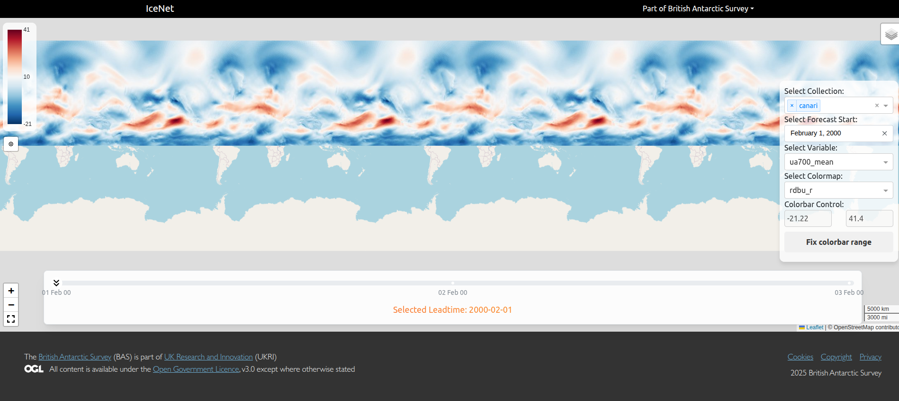

# BAS STAC deployment orchestrator

This meta-repository coordinates deployment of a modular architecture designed to process netCDF weather forecast predictions from Machine Learning workflows, catalog them (using STAC catalog), and serve them via layers of Databases, APIs and Dashboard.

- **[environmental-stac-generator](https://github.com/environmental-forecasting/environmental-stac-generator)** – An installable Python package that converts netCDF files to Cloud-Optimised GeoTIFFs (COGs) for use by the tiler.
- **[environmental-stac-dashboard](https://github.com/environmental-forecasting/environmental-stac-dashboard)** – A Plotly Dash web app for visualising environmental forecasts.

---

## Repo Structure

```bash
meta-repo/
├── custom_tms/ # Custom TileMatrixSets defining Matrix Sets for North and South projections (used by TiTiler Docker service)
├── environmental-stac-dashboard/ # Plotly Dash web-app served with Gunicorn
├── environmental-stac-generator/ # Data transformer: NetCDF → COGs, generate STAC catalog, ingest into pgSTAC database
├── data/ # Output COGs and STAC catalog generated by running `envstacgen` command from `environmental-stac-generator` install on IceNet and other prediction netCDF files
├── compose.yaml # Orchestrates all containers
├── compose.override.yaml # Local development: host ports and dashboard source bind-mount
├── compose.prod.yaml # Staging/production: Traefik HTTPS and path routing
└── Makefile # Top-level automation commands
```

This is the basic workflow, and how the different repositories interact between each other:



---

## Getting Started

### 1. Install Docker

Ensure [Docker](https://docs.docker.com/get-docker/) is installed on your system.


### 2. Clone the repo

To clone this repository and all including submodules, run:

```bash
git clone --recurse-submodules git@github.com:environmental-forecasting/environmental-stac-orchestrator.git
```

or, optionally, to clone a specific branch, run:

```bash
git clone --recurse-submodules -b 0.0.1_dev git@github.com:environmental-forecasting/environmental-stac-orchestrator.git
```

where, `-b <branch_name>` defines the branch you want to utilise.

### 3. Set up configuration ENV file

Each service is configured via environment variables. Docker Compose loads a per-environment file via `make` (`--env-file`). The host-side `envstacgen` CLI takes the same file explicitly with `--env-file` (suitable for laptops and HPC; no symlink required).

Each environment also uses its own Compose project name and Postgres volume (`POSTGRES_VOLUME_NAME`), so switching between development, staging, and production does not reuse the wrong database.

First, copy the template to your desired environment:

```bash
cp .env.template .env.development
```

Open `.env.development` (or your chosen environment file) and update the values as necessary, such as setting a secure `DATABASE_PASSWORD`. Set `COMPOSE_PROJECT_NAME` / `POSTGRES_VOLUME_NAME` if you customise them (defaults differ per env file).

> [!NOTE]  
> If deploying to staging or production, copy `.env.template` to `.env.staging` or `.env.production` instead, and ensure you configure `DOMAIN_NAME`, `ACME_EMAIL`, and (for staging) `ACME_CASERVER` for Traefik HTTPS.

> [!IMPORTANT]  
> The database password is applied when the PostgreSQL volume is first created. Changing `DATABASE_PASSWORD` later will not update an existing volume; use standard PostgreSQL tooling, or `make clear-db <env>` and recreate the stack. Removing a volume leaves any previous volume names on disk until you delete them manually (`docker volume ls`).

### 4. Build & Launch the Full Stack

#### Start containers

Select the command for your target environment:

```bash
# For local development (HTTP, local ports, hot-reloading; uses compose.override.yaml)
make dev

# Same, but stay attached to the logs (Ctrl+C stops the stack)
make dev attach

# For staging testing (HTTPS via Traefik; uses compose.prod.yaml and .env.staging)
make staging

# For production (HTTPS via Traefik; uses compose.prod.yaml and .env.production)
make prod
```

This will:

* Build all service images (environmental-stac-dashboard, pgstac, stac-fastapi, file-server, stac-browser).
* Launch the orchestrator stack using Docker Compose with the appropriate environment configuration.

`make dev` loads `.env.development` and automatically includes `compose.override.yaml` for published ports. `make staging` and `make prod` load the matching env file and layer `compose.prod.yaml` (Traefik) on top of `compose.yaml`. All three detach by default; add `attach` (e.g. `make dev attach`) to run in the foreground and follow logs.

#### Stop containers

```bash
make down dev
make down staging
make down prod
```

### 5. Install and Run netCDF -> CoG Preprocessor

> [!TIP]
> Follow the README in [environmental-stac-generator](https://github.com/environmental-forecasting/environmental-stac-generator/) for more detail regarding this step.

> [!NOTE]
> Preprocess writes a portable static catalog (cwd-relative asset paths such as
> `data/cogs/...`, no host). Pass `--env-file` at **ingest** so `FILE_SERVER_URL`
> and database credentials are applied for that environment. Preprocess itself does
> not need Docker or `FILE_SERVER_URL`.

```bash
pip install -e environmental-stac-generator/

envstacgen preprocess <path_to_netcdf_predictions>
```

#### Example usage:

To point to a directory with netCDF files:

`envstacgen preprocess results/predict/`

Using wildcards:

`envstacgen preprocess raw_data/*.nc`

You can include a non-default **STAC Collection** name (and multiple workers):

`envstacgen preprocess raw_data/*.nc -o -n <collection_name> -w 8`

This command will create a `data/` directory with the JSON catalog and CoG outputs.

```bash
data/
├── cogs/
│   └── <collection_name>/
│       └── <forecast_init_date>/
│           ├── forecast_init_<forecast_init_date>_lead_<valid_time>.jpg        # Thumbnail file
│           └── forecast_init_<forecast_init_date>_lead_<valid_time>.tif        # COG w/ internal overviews
├── netcdf/
│   └── <collection_name>/
│       └── <forecast_init_date>/
│           └── <forecast_init_date>.nc # netCDF predictions for this forecast init date, with all leadtimes stored in this file
└── stac/
    ├── <collection_name>/
    │   └── forecast_init_<forecast_init_date>/
    │       ├── forecast_init_<forecast_init_date>.json
    │       └── collection.json
    └── catalog.json

```

where, `valid_time` is the datetime corresponding to the forecast leadtime. (The date the COG prediction is for).


### 6. Ingest the JSON STAC catalogs into the Docker database service

> [!IMPORTANT]
> Ensure Docker services are up before ingest (database must be reachable). Ingest
> reads database credentials and `FILE_SERVER_URL` from `--env-file` (or the process
> environment). Portable asset paths in the JSON are prefixed with that URL when
> loading into pgSTAC.

To ingest the generated static STAC JSON catalog into the pgSTAC (postgresql) database, run:

```bash
envstacgen --env-file .env.development ingest data/stac/catalog.json -o
```

where, the `-o` will overwrite any existing matching entries (by default, will skip any matching).

### 7. Access the UI Interfaces and Docs

In **Development Mode** (`make dev`), services are published on host ports (configurable in `.env.development`). There is no Traefik path routing, so use the service roots (except where a service itself sets a root path):

* **Dashboard UI:** http://localhost:8082
* **STAC Browser:** http://localhost:81/browser
* **STAC FastAPI:** http://localhost:8000
* **File Server:** http://localhost:8001/data/
* **Tiler API:** http://localhost/tiles (same-origin proxy via the dashboard -> tiler-cache; direct debug port remains http://localhost:8002/)
* **PostgreSQL Database:** localhost:5432

In **Staging/Production Mode** (`make staging` or `make prod`), Traefik terminates HTTPS for `DOMAIN_NAME` (from `.env.staging` or `.env.production`) and routes by path prefix, for example:

* **Dashboard UI:** `https://example.bas.ac.uk/`
* **STAC Browser:** `https://example.bas.ac.uk/browser`
* **STAC FastAPI:** `https://example.bas.ac.uk/api`
* **File Server:** `https://example.bas.ac.uk/files`
* **Tiler API:** `https://example.bas.ac.uk/tiles`

### 8. Additional Make commands

#### Clear outputs

> [!CAUTION]
> These commands are destructive and will delete any generated data, only included for convenience.

To clear the data created by `envstacgen preprocess` command, run:

```bash
make clear-data
```

To delete the PostgreSQL database volume for an environment (clears ingested data for that env only):

```bash
make clear-db dev
make clear-db staging
make clear-db prod
```

To clear both `./data` and that environment’s database volume:

```bash
make clear-all dev
```

#### Leadtime scrub benchmark

With the dashboard stack running (`make dev`), measure leadtime scrub latency from the host (Playwright drives Chromium against the live UI):

```bash
pip install -r environmental-stac-dashboard/scripts/requirements-bench.txt
python3 environmental-stac-dashboard/scripts/bench_leadtime.py --label baseline
python3 environmental-stac-dashboard/scripts/bench_leadtime.py --label after-change --compare baseline
```

Results are written under `environmental-stac-dashboard/bench/results/` (gitignored). Optional: `BENCH_URL`, `BENCH_CHROMIUM`.

### FAQ

1. I see the following error with the database service:

```bash
pgstac-1    | Running PgSTAC migration...
database-1  | 2025-07-17 09:19:09.995 UTC [85] ERROR:  relation "pgstac.migrations" does not exist at character 38
database-1  | 2025-07-17 09:19:09.995 UTC [85] STATEMENT:  
database-1  |                   SELECT version from pgstac.migrations
database-1  |                   order by datetime desc, version desc limit 1;
database-1  |                   
pgstac-1    | 0.9.6
pgstac-1    | PgSTAC migration completed
pgstac-1 exited with code 0
```

This is expected, and part of `pypgstac migrate`'s approach when initialising an empty database.

### Examples

#### STAC Browser



#### Dashboard


CANARI example: (At altitude, so, not surface level variable, needs coastline overlay in future)



---

## Experimental Ansible Deployment

This will be streamlined and integrated into the internal BAS Ansible repo in the future, but, for testing, you can deploy to the internal VMware dev cluster by following these steps for a Rocky 9 VM.

> [!WARNING]  
> The playbooks are experimental and may still lag the Make/Compose workflow. Prefer `make prod` (or staging) on the host after configuring `.env.production`. Treat Ansible as a starting point until it is fully aligned.

1. Update the [inventory](inventory.yaml) with the VM IP/Domain name, and the username (Ensure you have access to the internal network).

1. Install Python 3.12 dependency (for `environmental-stac-generator`) using:

    ``` bash
    ansible-playbook --ask-become-pass -i inventory.yaml playbooks/python_install.yaml
    ```

    where, `--ask-become-pass` will ask you to enter the password needed for `sudo` access.

1. Deploy the entire stack:

    ``` bash
    ansible-playbook --ask-become-pass -i inventory.yaml playbooks/deploy.yaml
    ```

1. There is an undeploy playbook as well which is outdated:

    ``` bash
    ansible-playbook --ask-become-pass -i inventory.yaml playbooks/undeploy.yaml
    ```
